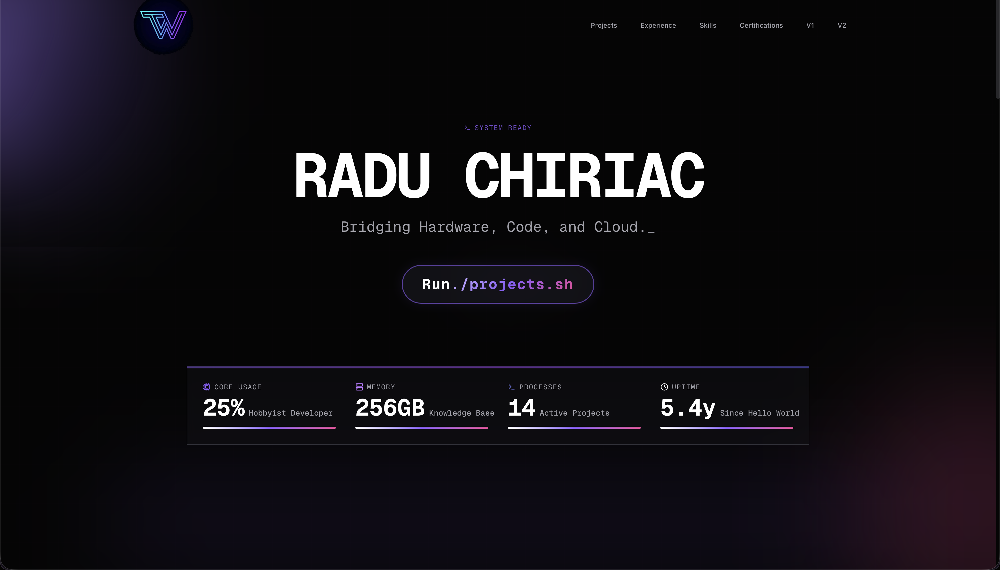

# Zero Dawn v3 🚀



The third iteration of my personal portfolio website, featuring a **terminal-inspired aesthetic** with dark mode visuals, custom typography (Geist Mono), and electric violet accents.

**Live Demo**: [v3.the-whiz.dev](https://v3.the-whiz.dev)

[](https://nextjs.org/)
[](https://reactjs.org/)
[](https://tailwindcss.com/)
[](LICENSE)

## ✨ Features

- **Terminal Aesthetic**: Unique brand identity with terminal-inspired visuals and electric violet accents
- **Modern UI/UX**: Built with React 19 and Next.js 16 for a fast, responsive experience
- **Dynamic Animations**: Powered by Framer Motion for smooth transitions
- **Dynamic Stats**: Real-time GitHub stats and project uptime tracking
- **Comprehensive Portfolio**: Projects ranging from Python automation to Flask web apps
- **Professional Timeline**: Detailed HPC and Technical Support experience
- **Modern Styling**: Tailwind CSS 4.0 for a clean, professional look
- **SEO Optimized**: Built-in meta tags and semantic HTML

## 🛠️ Tech Stack

- **Framework**: [Next.js 16 (App Router)](https://nextjs.org/)
- **Language**: [TypeScript](https://www.typescriptlang.org/)
- **Styling**: [Tailwind CSS 4.0](https://tailwindcss.com/)
- **Animations**: [Framer Motion](https://www.framer.com/motion/)
- **Icons**: [Lucide React](https://lucide.dev/)
- **Analytics**: [Vercel Speed Insights](https://vercel.com/docs/speed-insights)

## 🚀 Getting Started

### Prerequisites

- **Node.js**: >= 18.18.0
- **Package Manager**: npm

### Installation

```bash
git clone https://github.com/the-whiz84/zero-dawn-v3.git
cd zero-dawn-v3
npm install
npm run dev
```

Open [http://localhost:3000](http://localhost:3000) to see the result.

## 📦 Deployment

Deployed on [Vercel](https://vercel.com) at [v3.the-whiz.dev](https://v3.the-whiz.dev)

## 📄 License

This project is licensed under the MIT License - see the [LICENSE](LICENSE) file for details.

---

Built with ❤️ by [Radu Chiriac](https://the-whiz.dev)
